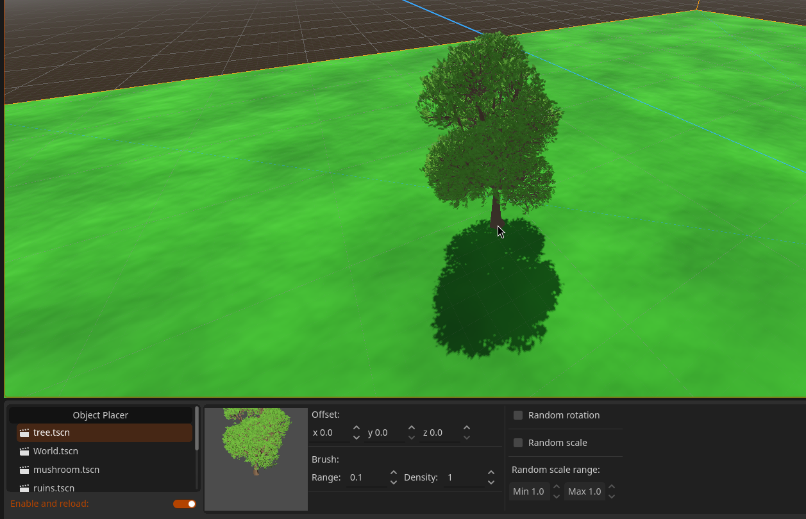

#  Simple Object Placer

## Addon Notice:
This addon was developed for internal use and for specific needs, it may lack functions for your needs. 

##
A simple Godot addon to place 3D objects/nodes on a 3D scene at mouse position using raycast.


Stylized Tree by yonimantz on Sketchfab

# How to use:
Clone this repo pasting this command on terminal:

```
 git clone https://github.com/BackFace-Softwares-INC/Simple-Object-Placer.git
```
After the repo is cloned, place the addons folder in your project.
Enable the addon on ```Project > Project Settings > Plugins > ObjectPlacer```

After enabling the plugin, a new tab named "Object Placer" should appear in the bottom panel, select the .tscn file on the file tree, set the offset, scale and random rotation and enable, then just click on the location where you want to place the object, the location need to has collision.

## What i do?
. BFOP.gd -> It's the code responsible for talking to the Engine and creating a new tab.
. ui/scripts/ui.gd -> It's the brain of the addon, it controls the interface and all the logic of positioning objects using raycast, it's a code with more than 200 lines, it can be complex, but don't worry, everything is very well documented.

## How the versions work?
There are four version positions (Example: V1.0.0.0). The first value is a release version, the second is a pre-release, the third is a beta version, and the fourth and last is an alpha version.
How does it work? It's simple; take a look at this example:

##The code uses snake_case.

v1.3.0.4 -> is a release version with three pre-release versions, meaning it's almost at its second release, and four features are in alpha.

feel free to contribute to the project ❤
