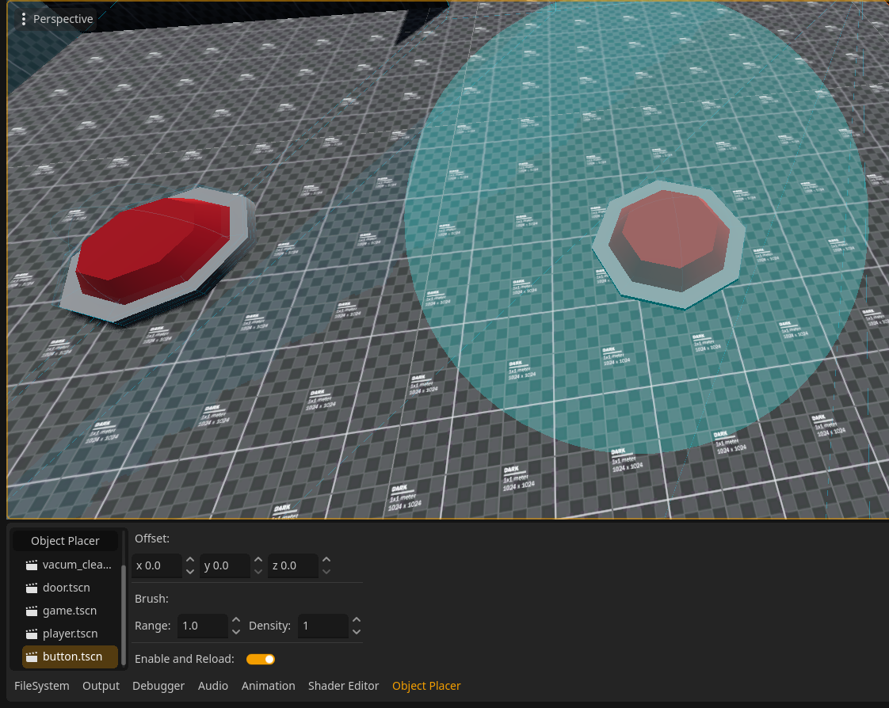

#  Simple Object Placer

## Addon Notice:
This addon was developed for internal use and for specific needs, it may lack functions for your needs. 

##
A simple Godot addon to place 3D objects/nodes on a 3D scene at mouse position using raycast.



# How to use:
Clone this repo pasting this command on terminal:

```
 git clone https://github.com/BackFace-Softwares-INC/Simple-Object-Placer.git
```
After the repo is cloned, place the addons folder in your project.
Enable the addon on ```Project > Project Settings > Plugins > ObjectPlacer```

After enabling the plugin, a new tab named "Object Placer" should appear in the bottom panel, place the object (PackedScene) in the empty slot, set the offset and enable, then just click on the location where you want to place the object, the location need to has collision.


# Documentation
* BFOP.gd is the main plugin code.
* plugin.cfg is the configuration file.
* ui/scripts/ui.gd is the main code, all the features and interface logic is on this file.
* plugin version logic > v: x.x.x.x -> x.x.x.Y = alpha version -> x.x.Y.x = beta version -> x.Y.x.x = release candidate version -> Y.x.x.x = release version.

feel free to contribute to the project ❤
